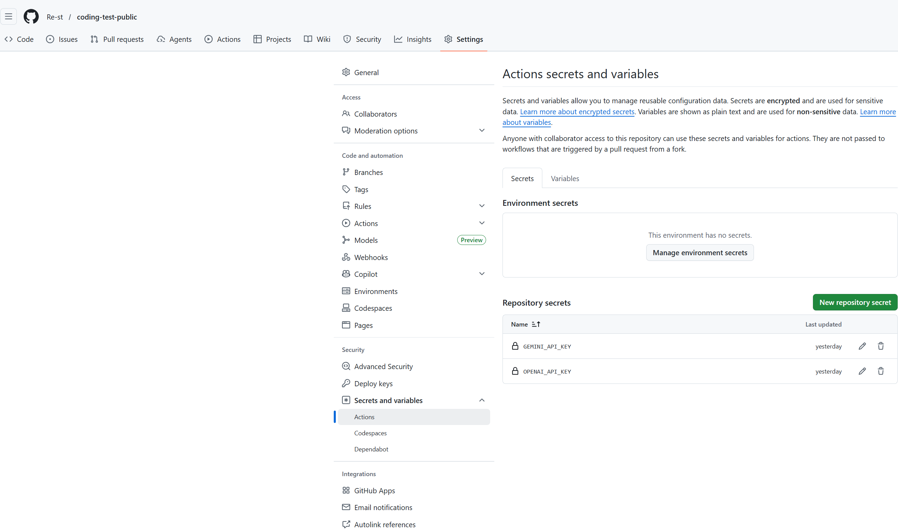

# README

이 레포는 BaekjoonHub를 통해 동기화된 코딩 테스트 솔루션을 수집합니다.

## 목차
1. [리뷰 섹션](#리뷰-섹션)
2. [언어/플랫폼별 디렉토리 구조](#언어플랫폼별-디렉토리-구조)
3. [리뷰 추가 방법](#리뷰-추가-방법)
4. [AI 응답 사용 노트](#AI-응답-사용-노트)

## 리뷰 섹션
리뷰는 코드에 대한 의견과 추가적인 설명을 제공하는 부분입니다. 각 문제에 대한 리뷰를 작성하는 방법에 대해 설명하겠습니다.

## 언어/플랫폼별 디렉토리 구조
이 레포지토리는 다양한 언어 및 플랫폼을 기준으로 문제를 분류합니다.

```
레포지토리/
│   README.md
│
├── python/
│   ├── 문제1.py
│   ├── 문제2.py
│
├── cpp/
│   ├── 문제1.cpp
│   └── 문제2.cpp
```

## 리뷰 추가 방법
1. 각 문제에 대한 리뷰는 해당 파일에 주석으로 추가합니다.
2. 명확한 설명과 함께 유용한 팁을 제공하세요.

## AI 응답 사용 노트
AI 응답을 사용할 때는 다음 스크린샷 가이드를 참조하십시오:


이 README는 코딩 테스트 솔루션을 체계적으로 관리하기 위한 가이드라인을 제공합니다.